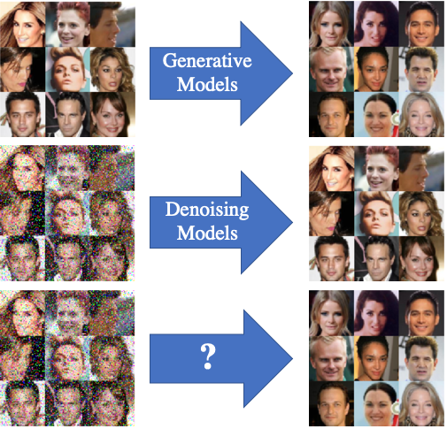
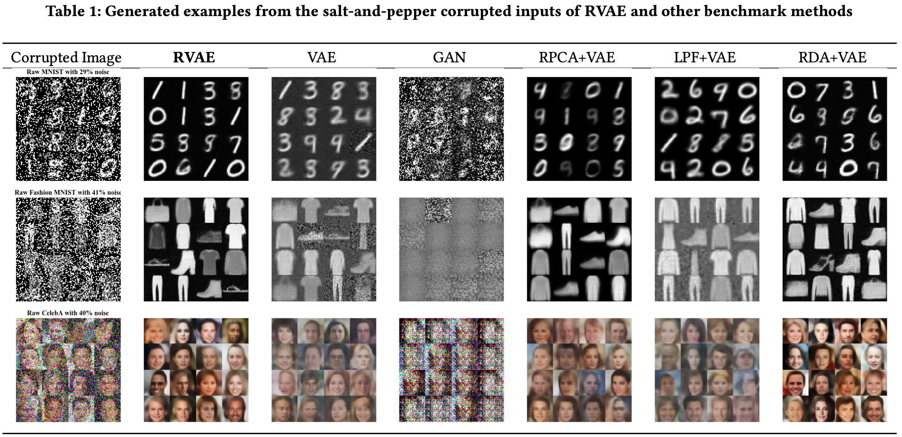

# RobustVAE
<p align="center">

  
</p>

## About
Source code of the paper: [Robust Variational Autoencoders: Generating Noise-Free Images from Corrupted Images](https://users.wpi.edu/~yli15/Includes/AdvML20_Huimin.pdf)

## Results
<p align="center">

</p>

## Usage
* Please first download the dataset of [CelebA](http://mmlab.ie.cuhk.edu.hk/projects/CelebA.html) before you use the code. Our repo only contains sample images due to the size limit.


## Citation
If you find this repo useful and would like to cite it, citing our paper as the following will be really appropriate: <br>
```
@article{ren2018robust,
  title={Robust Variational Autoencoders: Generating Noise-Free Images from Corrupted Images},
  author={Ren, Huimin and Yue, Yun and Zhou, Chong and Paffenroth, Randy C and Li, Yanhua and Weiss, Matthew L},
  year={2018}
}
```
